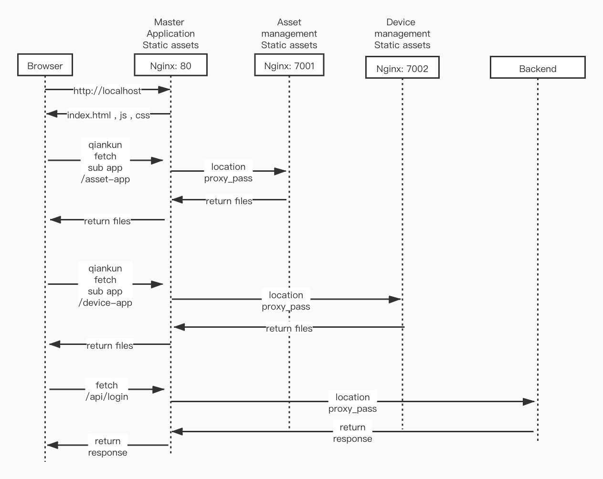

<center><p align="center"></p></center>

Tuya Iot Suite Portal -- 设备管理子应用
===

本应用为 Tuya Iot 研发套件 Web 管理控制台子应用
负责设备相关管理

[主应用请访问这里](https://github.com/tuya/iot-suite-portal)

## 目录结构

源码位置
```
iot-suite-portal-device
└── src
```

> 入口文件为src/index.tsx

完成目录结构
```
iot-suite-portal-device
├── README.md
├── README_zh.md
├── package.json
├── public
│   ├── favicon.ico
│   ├── index.html
│   ├── qrcode-scan.png
│   └── robots.txt
├── src
│   ├── App.css
│   ├── App.tsx
│   ├── components
│   │   ├── BAssetCascader
│   │   │   └── index.tsx
│   │   ├── BAssetTree
│   │   │   ├── index.less
│   │   │   ├── index.tsx
│   │   │   └── util.tsx
│   │   ├── BDP
│   │   │   ├── Block
│   │   │   │   ├── index.less
│   │   │   │   └── index.tsx
│   │   │   ├── Default
│   │   │   │   └── index.tsx
│   │   │   ├── Input
│   │   │   │   └── index.tsx
│   │   │   ├── Select
│   │   │   │   └── index.tsx
│   │   │   ├── Slider
│   │   │   │   ├── index.less
│   │   │   │   └── index.tsx
│   │   │   └── Switcher
│   │   │       └── index.tsx
│   │   ├── BModalForm
│   │   │   └── index.tsx
│   │   ├── YAddDevice
│   │   │   ├── AddDeviceModal.tsx
│   │   │   └── index.tsx
│   │   ├── YAssetCascader
│   │   │   └── index.tsx
│   │   ├── YAssetTree
│   │   │   ├── index.tsx
│   │   │   └── util.ts
│   │   ├── YDelDeviceModal
│   │   │   ├── index.less
│   │   │   └── index.tsx
│   │   └── utils
│   │       └── index.ts
│   ├── global.d.ts
│   ├── hooks
│   │   └── index.ts
│   ├── index.css
│   ├── index.tsx
│   ├── init.ts
│   ├── lang
│   │   ├── en.ts
│   │   ├── index.ts
│   │   └── zh.ts
│   ├── pages
│   │   ├── components
│   │   │   ├── CtrlDP.tsx
│   │   │   ├── EditDevice.tsx
│   │   │   ├── Table.Device.tsx
│   │   │   ├── dp.test.ts
│   │   │   └── table.less
│   │   ├── index.less
│   │   └── index.tsx
│   ├── public-path.js
│   ├── react-app-env.d.ts
│   └── reportWebVitals.ts
├── tsconfig.extend.json
├── tsconfig.json
├── typings.d.ts
└── yarn.lock
```

## 依赖情况

项目采用微前端架构，微前端框架采用[qiankun](https://qiankun.umijs.org/)
此项目为子应用，[主应用请访问这里](https://github.com/tuya/iot-suite-portal)

构建配置使用[CRACO](https://github.com/gsoft-inc/craco)
相关自定义配置
```
iot-suite-portal-device
└── .cracorc.js
```

## 部署说明
[主应用请访问这里](https://github.com/tuya/iot-suite-portal)
微前端架构可以独立部署基座应用和子应用，目前默认情况下使用单域名+多目录结构区分应用



## 调试说明

本地调试，启动命令，默认端口号为7002，默认调试地址 http://localhost:7002/
```
npm run start
```
